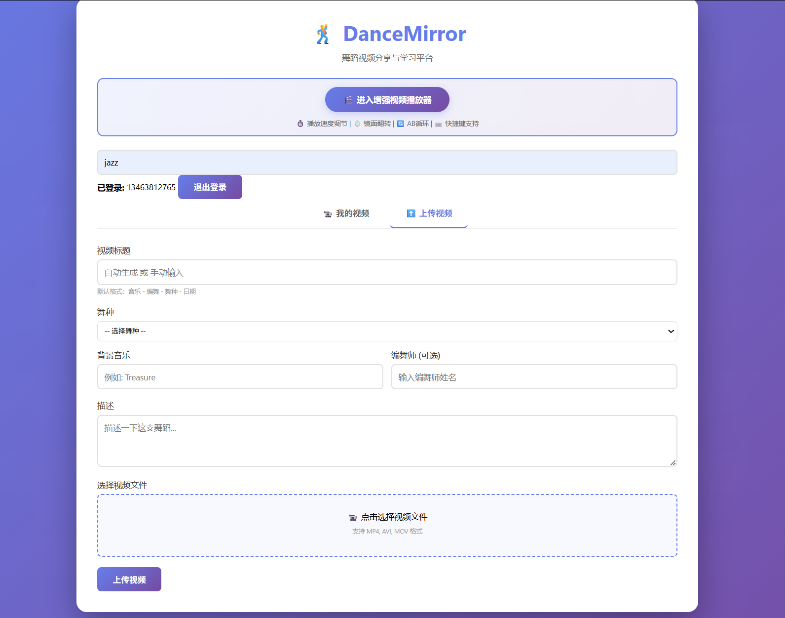
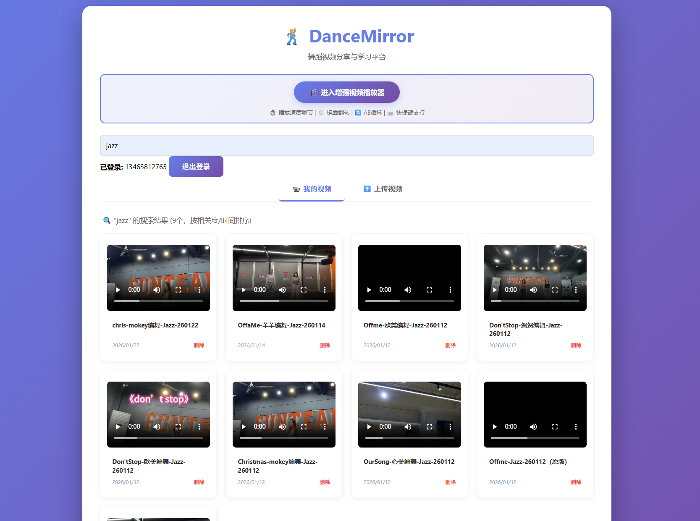
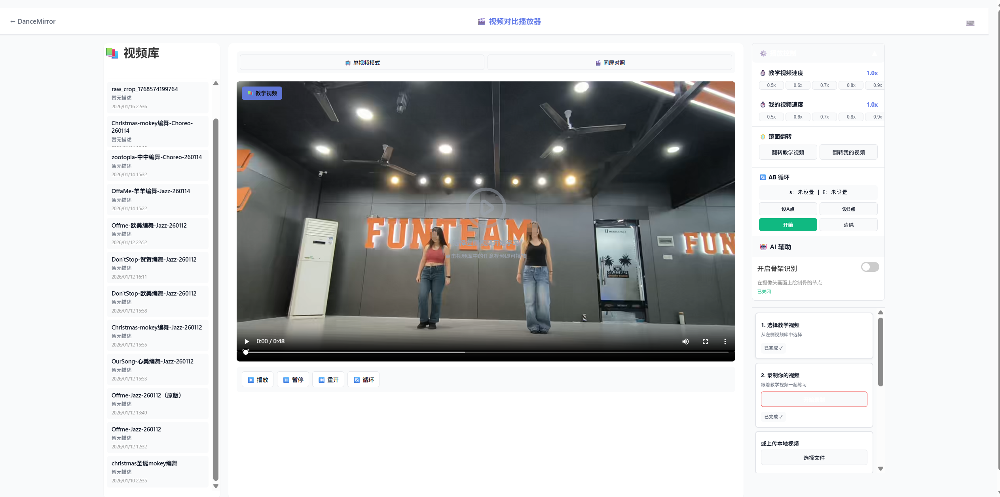
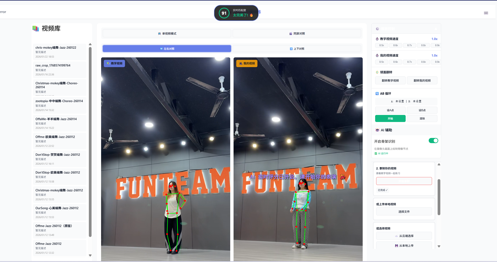
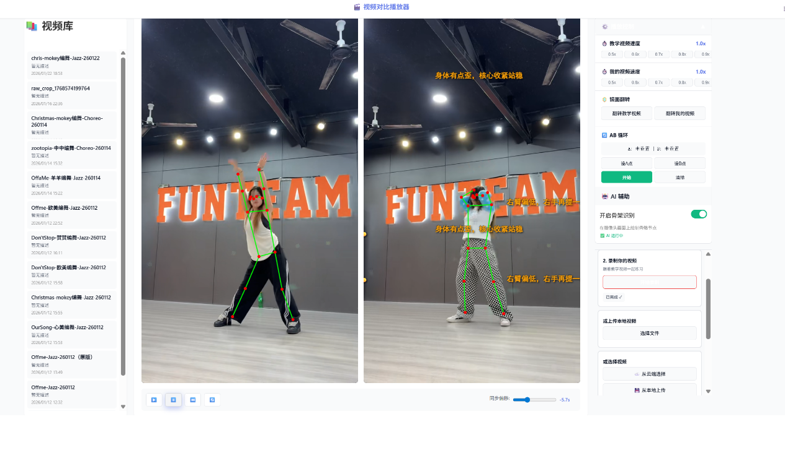

# DanceMirror - 扒舞学习助手


## 📱 项目简介

DanceMirror 是一个专为舞蹈学习者设计的练习辅助工具。通过上传教学视频，你可以：

- 🎬 多速播放（0.25x - 2x）
- 🪞 镜面翻转
- 🔁 AB 循环重复练习
- 📹 录制自己的练习视频
# 🕺 DanceMirror - 舞蹈镜像学习平台

一个专为舞蹈学习设计的视频分享和练习平台，支持慢速播放、镜面翻转和 AB 循环等功能。

## ✨ 功能特点

### 🎯 核心功能
- **用户系统**: 注册/登录、JWT 认证
- **视频管理**: 上传、浏览、播放舞蹈视频
- **增强播放器**: 单视频/对照模式、慢速播放、镜面翻转、AB 循环
- **录制与上传**: 浏览器录制、上传到云端、元信息填写
- **AI 分析**: 后端队列异步分析 + 评分/弹幕提示（可选 LLM 点评）

### 🎬 播放器特色功能
- **⏱️ 播放速度调节**: 0.5x - 1.5x，每次增加 0.1x，共 11 档速度
- **🪞 镜面翻转**: 一键切换镜像模式，方便对镜练习
- **🔄 AB 循环**: 设置起止点，重复练习难点动作
- **🎯 单/双视频对照**: 教学视频与练习视频同步比对
- **🧩 视频裁剪**: 前端裁剪（Canvas + ffmpeg.wasm），可接入云端裁剪
- **💬 弹幕提示**: 根据分析结果显示实时提示

## ✅ 当前实际功能
- 账号注册/登录、JWT 鉴权
- 视频上传、列表、播放、删除
- 练习录制、元信息填写、上传
- 单视频与对照模式切换
- 慢速播放/镜像/AB 循环
- AI 评分与弹幕提示（基于姿态检测）
- 异步分析队列（RabbitMQ）+ 缓存（Redis）

## 🏗️ 技术栈

### 后端
- **语言**: Go 1.20+
- **路由**: Gorilla Mux
- **ORM**: GORM（AutoMigrate）
- **数据库**: MySQL 8.0
- **缓存**: Redis
- **队列**: RabbitMQ（裁剪/分析任务）
- **搜索**: Elasticsearch
- **对象存储**: MinIO（可选）/ 本地存储
- **观测性**: OpenTelemetry + 自定义 Logger
- **认证**: JWT (JSON Web Tokens)
- **文件上传**: Multipart Form Data

### 前端
- **纯原生**: HTML5 + CSS3 + JavaScript
- **视频播放**: HTML5 Video API
- **姿态检测**: TensorFlow.js + MoveNet
- **裁剪**: Canvas + ffmpeg.wasm
- **存储**: LocalStorage (Token 管理)
- **PWA**: service-worker + manifest

### AI/Worker
- **语言**: Python
- **姿态检测**: MediaPipe Pose
- **视频处理**: OpenCV
- **数据处理**: NumPy
- **队列/缓存**: RabbitMQ + Redis
- **LLM（可选）**: Google Gemini（google-generativeai）

### 数据库
- **迁移工具**: golang-migrate
- **表设计**: users, videos, practices, analysis_tasks, schema_migrations

## 📦 项目结构

```
DanceMirror/
├── cmd/
│   ├── main.go              # 应用入口
│   ├── api/
│   │   └── api.go          # API 路由配置
│   └── migrate/
│       ├── main.go         # 数据库迁移工具
│       └── migrations/     # 迁移文件
├── config/
│   └── env.go              # 环境配置
├── db/
│   └── db.go               # 数据库连接
├── service/
│   ├── auth/               # JWT 认证
│   ├── cache/              # Redis
│   ├── mq/                 # RabbitMQ
│   ├── search/             # Elasticsearch
│   ├── storage/            # MinIO/本地存储
│   ├── user/               # 用户管理
│   └── video/              # 视频管理
├── ai_worker/              # Python AI Worker
├── types/
│   └── types.go            # 类型定义
├── utils/
│   └── utils.go            # 工具函数
├── static/
│   ├── index.html          # 主页面
│   └── video-player.html   # 增强播放器
├── uploads/                # 视频文件存储
├── .env                    # 环境变量
├── go.mod                  # Go 模块
└── Makefile               # 构建脚本
```

## 🚀 快速开始

### 1. 环境要求
- Go 1.20 或更高版本
- MySQL 8.0 或更高版本
- Redis
- RabbitMQ
- Elasticsearch
- （可选）MinIO
- Git / Docker（推荐）

### 2. 克隆项目
```bash
git clone https://github.com/Albert-tru/DanceMirror.git
cd DanceMirror
```

### 3. 配置环境变量
复制 `.env.example` 到 `.env` 并修改配置：
```bash
cp .env.example .env
```

编辑 `.env` 文件：
```env
APP_ENV=development
APP_PORT=8080

DB_HOST=localhost
DB_PORT=3306
DB_USER=dmuser
DB_PASSWORD=Dance@2025
DB_NAME=dancemirror

JWT_SECRET=your-super-secret-jwt-key
JWT_EXPIRATION=72h

UPLOAD_DIR=./uploads
MAX_UPLOAD_SIZE=524288000
```

### 4. 创建数据库和用户
```sql
CREATE DATABASE dancemirror;
CREATE USER 'dmuser'@'localhost' IDENTIFIED BY 'Dance@2025';
GRANT ALL PRIVILEGES ON dancemirror.* TO 'dmuser'@'localhost';
FLUSH PRIVILEGES;
```

### 5. 运行数据库迁移
```bash
make migrate-up
```

### 6. 构建并运行
```bash
# 构建
make build

# 运行
make run

# 或者直接运行
./bin/dancemirror
```

### 7. 访问应用/当前效果
- **主页**: http://localhost:8080/static/index.html
- **增强播放器**: http://localhost:8080/static/video-player.html

1. 个人主页
视频库显示（附搜索功能）、视频上传


2. 单视频练习模式

3. AI姿态分析功能


## 📚 API 文档

### 用户认证

#### 注册
```http
POST /api/v1/register
Content-Type: application/json

{
	"email": "user@example.com",
	"password": "password123",
	"firstName": "John",
	"lastName": "Doe"
}
```

#### 登录
```http
POST /api/v1/login
Content-Type: application/json

{
	"email": "user@example.com",
	"password": "password123"
}

Response:
{
	"token": "eyJhbGciOiJIUzI1NiIsInR5cCI6IkpXVCJ9..."
}
```

### 视频管理

#### 获取视频列表
```http
GET /api/v1/videos
Authorization: Bearer <token>
```

#### 上传视频
```http
POST /api/v1/videos/upload
Authorization: Bearer <token>
Content-Type: multipart/form-data

title: "我的舞蹈视频"
description: "描述"
video: <file>
```

#### 获取视频详情
```http
GET /api/v1/videos/{id}
Authorization: Bearer <token>
```

#### 删除视频
```http
DELETE /api/v1/videos/{id}
Authorization: Bearer <token>
```

## 🛠️ Makefile 命令

```bash
# 构建
make build

# 运行
make run

# 测试
make test

# 清理
make clean

# 数据库迁移
make migrate-up        # 应用迁移
make migrate-down      # 回滚迁移
make migrate-status    # 查看状态
```

## 📖 文档

- [前端使用指南](FRONTEND_GUIDE.md)
- [API 测试指南](API_TESTING.md)
- [数据库迁移验证](MIGRATION_VERIFICATION.md)
- [JWT 修复报告](JWT_FIX_REPORT.md)

## 🎯 开发路线图

### Phase 1: MVP - 基础视频管理 ✅ (已完成)
- [x] 用户注册/登录系统
- [x] 数据库设计
- [x] 视频上传功能
- [x] 视频播放器基础
- [x] 播放速度调节 (0.5x-1.5x)
- [x] 镜面翻转功能
- [x] AB 循环功能

### Phase 2: 用户体验优化 (计划中)
- [ ] 用户个人主页
- [ ] 视频缩略图
- [ ] 上传进度条
- [ ] 视频搜索和过滤
- [ ] 响应式设计优化
- [ ] ai姿态分析
- [ ] 弹幕鼓励

### Phase 3: 社区功能 (计划中)
- [ ] 视频评论/弹幕互动
- [ ] 点赞/收藏/关注
- [ ] 练习挑战与话题
- [ ] 动态通知

### Phase 4: 会员与高级功能 (计划中)
- [ ] 练习记录与成长报告
- [ ] AI 动作分析（更细粒度纠错 + 练习计划）
- [ ] 会员内容：专业课程、高清素材、专属练习集
- [ ] 会员权益：去广告、更多云端存储、批量导出
- [ ] 视频转码与 CDN 加速

## 🧩 已知问题/排查记录
- 前端调用方法不一致：`getVideoAnalysis` 与 `getAIAnalysisResult` 命名不统一导致报错。
- `DanmakuManager` 多处定义或未初始化，导致弹幕 `undefined`。
- 弹幕容器缺失（`danmakuContainer` / `singleDanmakuContainer`）导致弹幕不显示。
- 双/单视频模式缺少 `timeupdate` 驱动，弹幕不触发。
- Redis 缓存旧分析结果，需要清空或使用新视频验证。

## 🤝 贡献

欢迎贡献代码！请：
1. Fork 本仓库
2. 创建特性分支 (`git checkout -b feature/AmazingFeature`)
3. 提交更改 (`git commit -m 'Add some AmazingFeature'`)
4. 推送到分支 (`git push origin feature/AmazingFeature`)
5. 打开 Pull Request

## 📄 许可证

本项目采用 MIT 许可证 - 详见 [LICENSE](LICENSE) 文件

## 👤 作者

**Albert-tru**
- GitHub: [@Albert-tru](https://github.com/Albert-tru)

## 🙏 致谢

- 感谢所有贡献者
- 感谢开源社区的支持

## 📞 联系方式

如有问题或建议，请：
- 提交 Issue
- 发送邮件到项目维护者

---

⭐ 如果这个项目对你有帮助，请给个星标！
